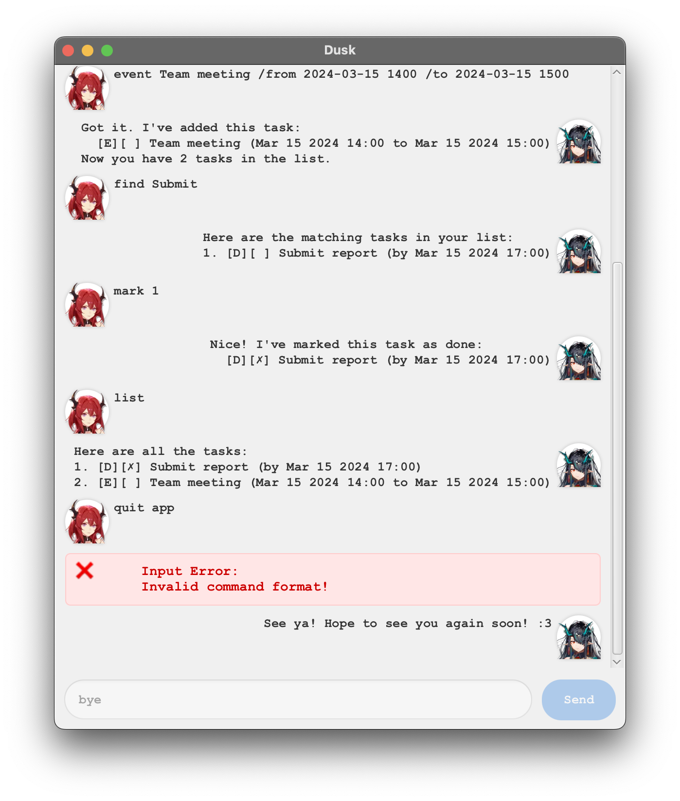

# Dusk Task Manager - User Guide

## Table of Contents

- [Introduction](#introduction)
- [Command Format](#command-format)
- [Basic Commands](#basic-commands)
    - [Viewing Tasks](#viewing-tasks)
    - [Finding Tasks](#finding-tasks)
    - [Managing Task Status](#managing-task-status)
    - [Deleting Tasks](#deleting-tasks)
- [Creating Tasks](#creating-tasks)
    - [Simple Tasks](#simple-tasks)
    - [Deadlines](#deadlines)
    - [Events](#events)
- [Date and Time Format](#date-and-time-format)



## Introduction

Dusk is a command-line task manager that helps you keep track of your todos, deadlines, and events. This guide will help
you understand how to use all available commands :DD

### How to Use

To run Dusk, use the following command in your terminal:

```bash
java -jar dusk.jar
```

### Requirements

- **macOS**: Java 17 Azure edition
- **Windows/Linux**: Java 17 SDK

### Exiting the Program

To exit Dusk, type:

```text
bye
```

💡 **Tip**: Tasks are automatically saved and loaded between sessions, so exiting the program (even accidentally) will
not result in data loss.

## Command Format

Commands follow this general structure:

```text
<command_word> [description] [flags]
```

💡 **Note**:

- Words in `<angle brackets>` are required
- Words in `[square brackets]` are optional
- Flags start with `/` followed by the flag name

## Basic Commands

### Viewing Tasks

To view your tasks, use the `list` command:

```text
list // Shows all tasks list /on 2024-03-15 // Shows tasks for specific date
```

### Finding Tasks

To search for specific tasks:

```text
find <search_term> // Searches for tasks containing the search term
```

Example:

```text
find project // Finds all tasks containing the word "project"
```

### Managing Task Status

Mark tasks as done or undone:

```text
mark <task_number> // Marks a task as complete
unmark <task_number> // Marks a task as incomplete
```

Example:

```text
mark 1 // Marks the first task as complete
unmark 2 // Marks the second task as incomplete
```

### Deleting Tasks

Remove tasks from your list:

```text
delete <task_number> // Deletes the specified task
```

Example:

```text
delete 3 // Deletes the third task
```

## Creating Tasks

### Simple Tasks

For basic todos without deadlines:

```text
todo
```

Example:

```text
todo Buy groceries
```

### Deadlines

For tasks with a due date:

```text
deadline  /by
```

Example:

```text
deadline Submit report /by 2024-03-15 1700
```

### Events

For events with start and end times:

```text
event  /from <start_datetime> /to <end_datetime>
```

Example:

```text
event Team meeting /from 2024-03-15 1400 /to 2024-03-15 1500
```

## Date and Time Format

Dates and times should be specified in the following format:

- **Date**: `yyyy-MM-dd` (required)
- **Time**: `HHmm` (optional, 24-hour format)

Examples:

```text
2024-03-15 // March 15, 2024 (defaults to 00:00) 2024-03-15 1430 // March 15, 2024, 2:30 PM
```

💡 **Tips**:

- If time is not specified, it defaults to midnight (00:00)
- Use 24-hour format for times (e.g., 1430 for 2:30 PM)
- All dates must be in the format YYYY-MM-DD
